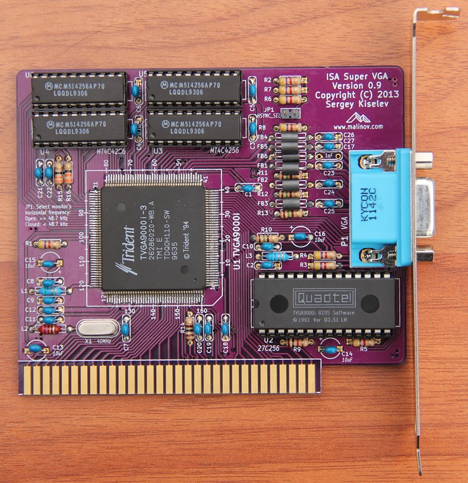
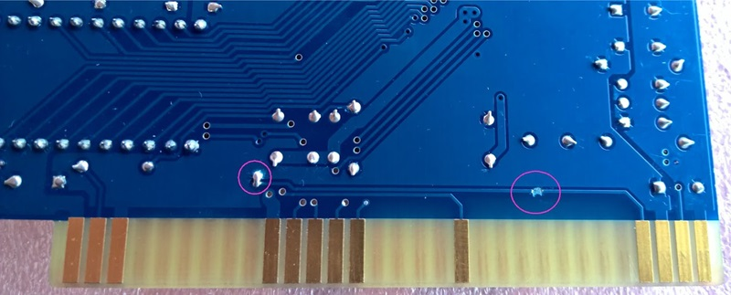

# isa-super-vga
Trident TVGA9000i based Super VGA board

## Introduction

The ISA Super VGA card is based on the Trident TVGA9000i Super VGA controller IC. It offers excellent compatibility with the original IBM VGA, as well as a good emulation of older CGA, EGA, Hercules and MDA adapters. The ISA Super VGA card was designed to be used with the [Xi 8088 Processor Board](https://github.com/skiselev/xi_8088), but it also works in IBM PC/XT and their clones. It will work in 16-bit ISA slots of AT-compatible computers, but its performance will be inferior to 16-bit VGA cards.

Note: PCB Version 1.0 requires a rework for compatibility with the original IBM PC and IBM XT computers, please see the Errata section below. This errata was fixed in the PCB Version 1.1

## Specifications

* Supports 256 KiB or 512 KiB video memory using two or four 256 Kbit x 4 DRAM ICs.
* 8088-friendly VGA BIOS.
* Only 6 ICs (SVGA IC, BIOS, four DRAM chips), some capacitors, resistors and inductors.

## Hardware Documentation

### Schematic and PCB Layout

[Schematic - Version 1.1](KiCad/ISA_SVGA-Schematic-1.1.pdf)

[PCB Layout - Version 1.1](KiCad/ISA_SVGA-Board-1.1.pdf)

### Bill of Materials

Component Type     | Reference | Description                                               | Quantity | Possible sources and notes
------------------ | --------- | --------------------------------------------------------- | -------- | --------------------------
PCB                |           | ISA Super VGA PCB                                         | 1        | Refer to the [RetroBrew Computers Board Inventory page](https://retrobrewcomputers.org/doku.php?id=boardinventory) for ordering information, or order from a PCB manufacturer of your choice using provided Gerber or KiCad files. Here is [OSH Park project link](https://oshpark.com/shared_projects/M9jRwsu1).
Integrated Circuit | U1        | Trident TVGA9000i-3                                       | 1        | Utsource or other component dealers. Other TVGA9000i versions can be used (e.g. TVGA9000i-1)
Integrated Circuit | U2        | 27C256 UV erasable EPROM or OTP ROM                       | 1        | Unicorn Electronics, Jameco, Mouser (OTP ROM)
Integrated Circuit | U3 - U6   | Micron MT4C4256, Motorola MCM514256, or similar 256 Kbit x 4 DRAM, 70ns or less | 2 or 4 | Unicorn Electronics. Install 4 for the total memory of 512 KiB or two for 256 KiB.
Capacitor          | C1 - C12  | 0.1 uF ceramic, 5.08 mm pitch                             | 12       | Mouser 810-FG28X7R1H104KNT0 
Capacitor          | C13 - C16 | 10 uF, 16V, multilayer ceramic or tantalum, 5.08 mm pitch | 4        | Mouser 810-FG26X7R1E106KRT0 
Capacitor          | C17       | 1 nF ceramic, 5.08 mm pitch                               | 1        | Mouser 810-FG28C0G2A102JNT6
Capacitor          | C18       | 470 pF ceramic, 5.08 mm pitch                             | 1        | Mouser 810-FG28C0G1H471JNT0 
Capacitor          | C19       | 100 pF ceramic, 5.08 mm pitch                             | 1        | Mouser 810-FG28C0G1H101JNT0 
Capacitor          | C20 - C27 | 47 pF ceramic, 5.08 mm pitch                              | 8        | Mouser 810-FG28C0G1H470JNT0
Resistor           | R1 - R8   | 4.7 k, 1/4 W                                              | 8        | Mouser 291-4.7K-RC
Resistor           | R9        | 1 k, 1/4 W                                                | 1        | Mouser 291-1K-RC
Resistor           | R10 - R13 | 150 Ohm, 1/4 W                                            | 4        | Mouser 291-150-RC
Resistor           | R14       | 100 Ohm, 1/4 W                                            | 1        | Mouser 291-100-RC
Resistor           | R15, R16  | 33 Ohm, 1/4 W                                             | 2        | Mouser 291-33-RC
Connector          | P1        | DE15F, right angle PCB mount                              | 1        | Mouser 806-K66X-E15S-NJVESA, 571-1-1734344-1 (blue color), 806-K66X-E15S-NJ30
Connector          | JP1       | 2 pin header                                              | 1        | Mouser 649-68002-102HLF
Inductor           | L1, L3    | 5.7 uH                                                    | 2        | Mouser 542-78F5R6J-RC
Inductor           | L2        | 2.7 uH                                                    | 1        | Mouser 542-78F2R7-RC
Filter             | FB1 - FB6 | EMI Filter Bead                                           | 6        | Mouser 623-2743001112LF
Crystal            | X1        | 40 MHz                                                    | 1        | Mouser 815-ABL-40-B2
Crystal Insulator  | X1        | Bivar CI-192-028-SR                                       | 1        | Mouser 749-CI-192-028-SR, optional, to prevent crystal from shortcircuiting the traces underneath it.
IC Socket          | U2        | 28 pin 600 mil (wide) DIP socket                          | 1        | Mouser 517-4828-6000-CP
IC Socket          | U3 - U6   | 20 pin 300 mil (narrow) DIP socket                        | 4        | Mouser 517-4820-3000-CP
Bracket            |           | ISA card bracket - Keystone 9200-1                        | 1        | Mouser 534-9200-1, or a [3D printed bracket](https://www.thingiverse.com/thing:6473572)

### Construction Notes

#### Display Type Detection

* TVGA9000i VGA controller uses VGA connector pin 12 as **MONITOR** signal to detect the of type of the display. Older, pre-[DDC](https://en.wikipedia.org/wiki/Display_Data_Channel) displays made approximately until 1995, have that signal either unconnected - for color monitors, or grounded - for monochrome monitors. Newer displays use that signal as the DDC/SDA signal. Unfortunately, it can result in TVGA9000i incorrectly detecting the monitor as monochrome. If you're not planning to use monochrome monitor, you can skip FB6 and C17 components. In this case R6 will be pulling the MONITOR signal up, and TVGA9000i will detect the display as a color one.

## Changes

### Version 1.1

* Fix ALE errata. ALE signal is now connected to 5V
* Slightly move VGA DE-9F connector (about 1.27 mm up and 0.8 mm back) to better comply with ISA card size and bracket placement specifications

### Version 1.0

* Minor board modifications around JP1

## Errata

### Version 1.1
* C17 is incorrectly marked as 1 uF on the silkscreen. The correct value is 1 nF, as shown in the BoM. Also see **Display Type Detection** note above.

### Version 1.0

* The original IBM PC, the original IBM XT, and XT clones that closely follow IBM XT schematic do not implement the ALE signal properly. In these computers the ALE signal occasionally activated during DMA cycles, for example during memory refresh, while the address on the address bus is invalid. This confuses the Trident TVGA controller. The following rework is required to make ISA Super VGA work in these computers: The TVGA9000 ALE signal needs to be disconnected from the ISA ALE signal, and connected to the 5V power signal. The photo below shows such modification (photo credit: [keropi](https://forum.vcfed.org/index.php?members/keropi.23086/) at [VCFed forum](https://forum.vcfed.org/index.php)).

